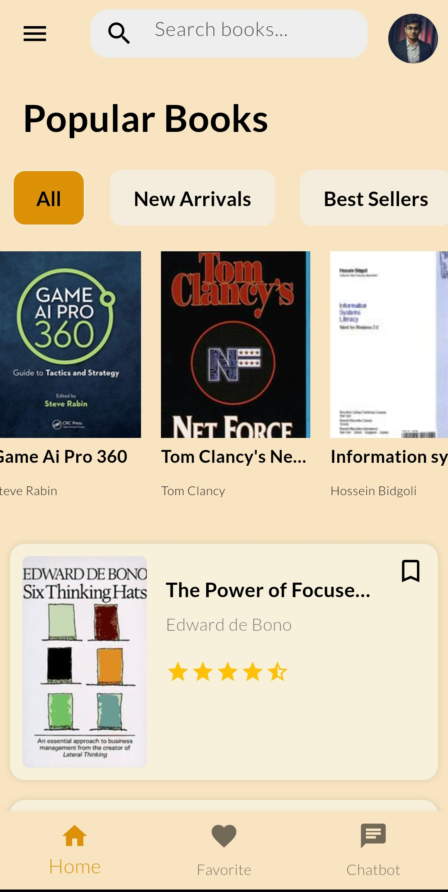
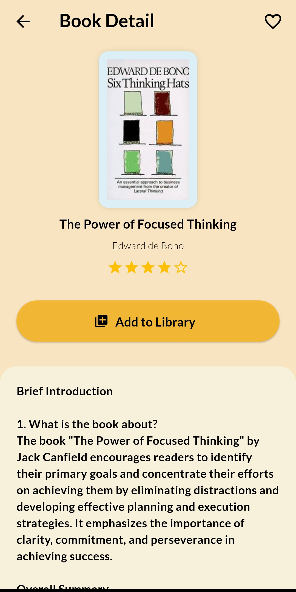
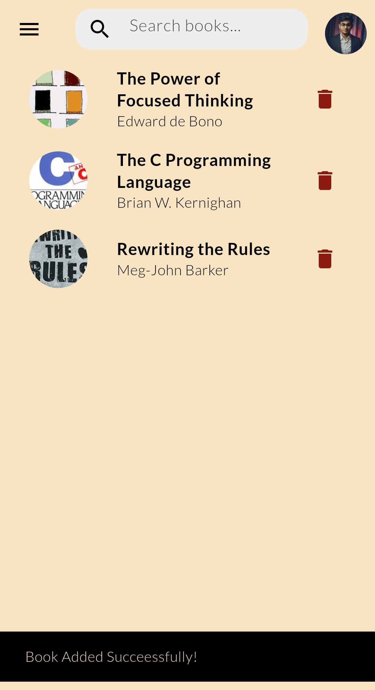
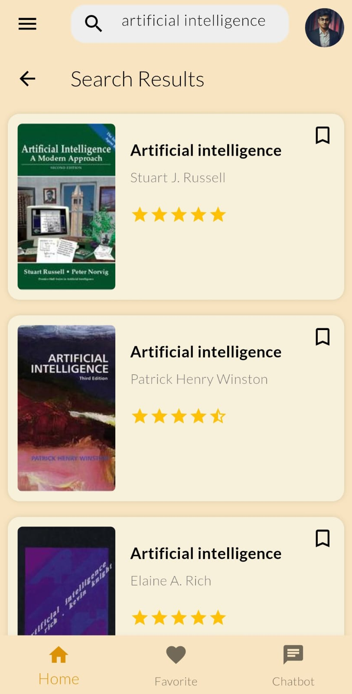
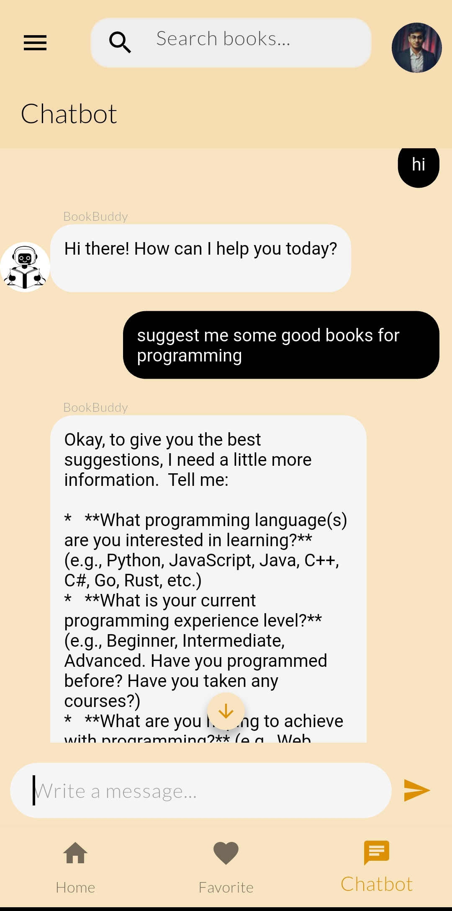
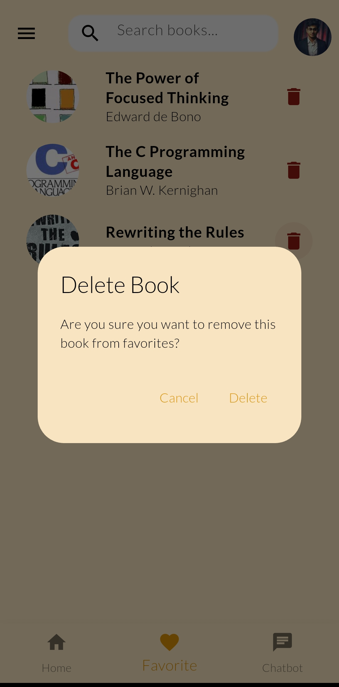

<h1 align="center">📚 BookBuddy AI</h1>

<p align="center">
  <b>BookBuddy AI</b> is a smart, AI-powered Flutter app that connects you with over <b>20 million books</b>.<br>
  <i>Search, summarize, chat, and discover your next favorite read!</i>
</p>

<p align="center">
  
  
  
  
  


</p>

---

## 🌟 Project Overview

**BookBuddy AI** is your personal book companion, powered by Flutter and AI. Instantly search millions of books, chat with AI about any book, get chapter-wise summaries, and manage your favorites—all in a beautiful, modern interface.


---

## 🚀 Features

- 🔍 **Search Books** by title, author, or keywords
- 🤖 **Chat with Books** using AI (get insights, ask questions)
- 📑 **Chapter-wise AI Summaries** generated on demand
- 📌 **Favorites Page** to save and revisit your books
- 💬 **Chat Interface** for deep interaction with content
- 🌙 **Dark Mode Ready** *(adapts to system settings)*

---


## 🏗️ Code Structure & Design Pattern

The project follows a **Provider-based MVVM (Model-View-ViewModel)** architecture for clean separation of concerns and scalability:

```
lib/
 ├── main.dart                # App entry point, theme, and provider setup
 ├── provider/                # ViewModels (state management)
 │    └── favorite_provider.dart
 ├── screen/                  # Views (UI screens)
 │    ├── book_detail.dart
 │    ├── book_search.dart
 │    ├── chat_bot_interface.dart
 │    ├── favorite_page.dart
 │    └── home_page.dart
 └── widget/                  # Reusable UI components
      ├── book_card.dart
      ├── chat_bot.dart
      └── vertical_book_card.dart
assets/
 ├── fonts/
 └── screenshot/
```

- **Provider** is used for state management (ViewModel).
- **Screens** represent the UI (View).
- **Widgets** are reusable UI components.
- **Models** (if any) would represent data structures.

---


## 🖼️ Screenshots

| Home | Favorite Page | Book Details | Removing Favorite | AI Chat Bot | Search Result |
|:----:|:--------------:|:------------:|:---------:|:--------------:|:--------------:|
|  |  |  |  |  |  |

---

## 📽️ Demo 
<video controls src="./video/screen-20250522-112031.mp4" title="Title" width="320"></video>

## 🛠️ Getting Started

1. **Clone the repository**
   ```bash
   git clone https://github.com/HAMZOO0/bookbuddy-ai.git
   cd bookbuddy-ai
   ```

2. **Install dependencies**
   ```bash
   flutter pub get
   ```

3. **Set up API keys**  
   Create a `.env` file in the root directory for any required API keys (e.g., OpenAI, Google Books API).
   ``` 
   GEMINI_API_KEY = 'Add Your APi Key';
   ```

4. **Run the app**
   ```bash
   flutter run
   ```

---

